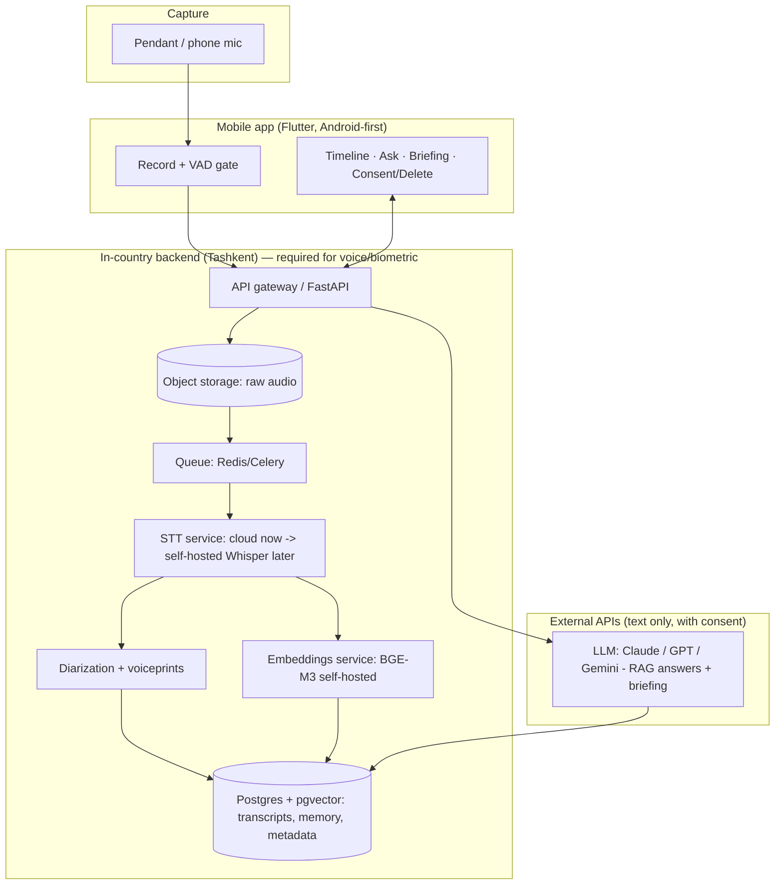

# Omnisense — Development Plan

> The engineering plan to build Omnisense: architecture, tech stack, the Uzbek/Russian
> speech workstream (the moat), the build pipeline, and a phased delivery schedule.
> Pairs with [`business-plan.md`](./business-plan.md), [`demo-sprint.md`](./demo-sprint.md)
> (the 30-day demo at planning level — this doc adds the engineering depth),
> [`master-plan.md`](./master-plan.md), and [`market-research.md`](./market-research.md).

**Build context (decided):** software-first, audio-first; **1-month demo** on off-the-
shelf hardware → funded build; **Uzbekistan** (Uzbek + Russian, budget Android, data
localization); **conversation memory (Pillar 1)** first; cheap audio pendant.

---

## 0. Engineering principles

1. **Ship the loop, not the vision.** One pipeline — capture → transcribe → remember →
   answer → brief — built once for audio, reused later for screen/vision.
2. **Edge + cloud, residency-aware.** Cheap/private work near the user and in-country;
   heavy reasoning via APIs on *text* (not voice). **Voiceprints never leave Uzbekistan.**
3. **Bilingual from line one.** Russian works off the shelf; **Uzbek is a first-class
   workstream**, not an afterthought.
4. **Privacy/security by construction.** Default-off, encrypted, deletable, consented —
   built in, never bolted on. No secrets in client code.
5. **Demo-then-harden.** The demo may use cloud STT and shortcuts; production swaps in
   the in-country, self-hosted stack behind the same interfaces.
6. **Interfaces over implementations.** Wrap STT, embeddings, and the LLM behind our own
   service interfaces so we can swap cloud↔self-hosted without touching the app.

---

## 1. System architecture



**Residency split (compliance by design):**
- **Must stay in Uzbekistan:** raw audio, **voiceprints/speaker embeddings**, the STT +
  diarization services, the primary database.
- **May go abroad (derived, post-2026 reform, with consent + safeguards):** transcribed
  **text** sent to an external **LLM** for answers/briefings. *Hardening option at scale:*
  self-host an open LLM (Qwen/Llama/Gemma) in-country to remove cross-border text flow.
- Watch the pending "adequate-country" list; keep an in-country fallback for everything.

---

## 2. Tech stack (opinionated)

| Layer | Choice | Why / notes |
|---|---|---|
| **Mobile app** | **Flutter** (Android-first) | One codebase, fast; native modules for background audio + BLE. *Alt: native Kotlin if background reliability demands it.* |
| **Backend** | **Python + FastAPI** | Best AI/ML ecosystem; async; easy to wrap STT/embeddings. |
| **Queue/cache** | **Redis + Celery/RQ** | Async audio processing jobs. |
| **Database** | **Postgres + pgvector** | Transcripts + vectors + time/speaker metadata in one DB. Qdrant later at scale. |
| **VAD** | **Silero VAD** | Drop silence on-device/edge → cut cost massively. |
| **STT (demo/beta)** | **Yandex SpeechKit** (Uzbek + Russian) | Best commercial Uzbek; Google `uz-UZ` as fallback. |
| **STT (production)** | **Self-hosted fine-tuned Whisper** (CTranslate2 / faster-whisper, GPU in Tashkent) | Cost + residency + Uzbek-quality moat (§6). |
| **Diarization** | **pyannote 3.1** (open) → NeMo Sortformer | "Who said what" — our quality edge; owner voice enrollment. |
| **Embeddings** | **BGE-M3** (multilingual, self-hosted) | Handles RU/UZ; keeps data in-country. Test Uzbek recall quality. |
| **Memory/RAG** | Custom RAG over pgvector (demo) → **Mem0 + Graphiti** (entities/commitments, temporal) | Episodic + semantic memory; hybrid (vector + keyword) retrieval. |
| **LLM (assistant + briefing)** | **Claude** (primary), GPT/Gemini fallback | Strong multilingual reasoning. Evaluate Uzbek output quality; self-host option later. |
| **Auth** | Phone OTP (local norm) | Common in UZ; add email later. |
| **Payments** | **Payme + Click** (PayTechUZ), carrier billing, BNPL | Post-demo (§10). |
| **Infra** | Docker; in-country VM/k8s; **GitHub Actions** CI/CD | Start simple (Compose / managed VM), k8s when scaling. |
| **Observability** | Structured logs + Sentry + basic metrics | Track latency, STT accuracy, cost/user. |

---

## 3. Repository & project structure

Monorepo (this repo):
```
/mobile        Flutter app (record, timeline, ask, briefing, consent/delete, RU/UZ i18n)
/backend       FastAPI: API, ingestion, processing orchestration, RAG, briefing
/ml            STT fine-tuning + eval harness, diarization, embeddings, model serving
/infra         Docker, IaC, deploy scripts, environment config
/docs          (existing) plans & research
```
Conventions: trunk-based, PRs + review, GitHub Actions on every PR (lint, tests, build),
secrets via environment/secret manager (never in code), semantic versioning for the app.

---

## 4. Environments & infrastructure

- **dev** (local: Docker Compose — Postgres, Redis, backend; STT mocked or cloud).
- **staging** (in-country VM mirroring prod; real cloud STT; test data).
- **prod** (in-country Tashkent host for voice/DB/STT; external LLM via API with consent).
- **CI/CD:** GitHub Actions → build/test → containerize → deploy to staging → manual gate
  → prod. Migrations via Alembic.
- **Data stores:** Postgres (encrypted at rest), object storage (encrypted; short
  retention for raw audio — transcribe then optionally purge audio), Redis.

---

## 5. The pipeline (component detail)

1. **Capture** — app records on demand (default-off); **Silero VAD** drops silence;
   audio chunked (e.g., 30–60s) and uploaded over TLS. (Pendant streams over BLE → phone
   → backend.)
2. **Ingest** — backend stores raw audio (in-country), enqueues a processing job.
3. **Transcribe** — STT service (cloud Yandex now / self-hosted Whisper later) →
   timestamped text in RU/UZ.
4. **Diarize** — pyannote labels speakers; **owner enrolled via voiceprint** (kept
   in-country) so "you" vs "others" is reliable; users can correct labels.
5. **Index** — chunk transcript → **BGE-M3 embeddings** → pgvector with metadata (time,
   speaker, session, language). Hybrid retrieval (vector + keyword) for names/exact terms.
6. **Distill (phase 1+)** — extract entities, decisions, commitments into a lightweight
   **knowledge graph** (Graphiti) for "what did I commit to / what changed."
7. **Answer** — user question → retrieve top-k chunks/facts → **LLM** answers **in the
   user's language with citations** (timestamp + speaker).
8. **Brief** — scheduled job summarizes the day: decisions, action items, key quotes →
   morning push.

Latency target: recall answers < ~2s; transcription/briefing are async (acceptable to
process after the meeting).

---

## 6. The Uzbek/Russian speech workstream (the moat) — R&D track

Russian is largely solved (cloud or fine-tuned Whisper ~6% WER). **Uzbek is the work and
the moat.** Run this as a dedicated track starting in Phase 1.

- **Data:** **UzbekVoice.ai (~1,400h)**, **Mozilla Common Voice Uzbek (~265h)**, USC,
  FeruzaSpeech; grow with (consented) in-product data later. Uzbek uses Latin script.
- **Model:** fine-tune **Whisper (medium → large-v3)** on Uzbek; target WER materially
  below stock (community baselines ~14% WER exist — beat them). Add a domain LM for
  meeting vocabulary.
- **Serving:** **faster-whisper / CTranslate2** on a **GPU in Tashkent** (in-country =
  residency + amortized cost). Streaming + batch modes.
- **Eval harness (build first):** held-out RU + UZ test sets; track **WER, diarization
  error rate, latency, $/hour**; gate model promotion on metrics; include noisy/accented
  and code-switched (RU↔UZ) samples.
- **On-device (v2):** quantized Whisper for capable phones only; keep cloud/in-country
  for the budget-Android majority.

**Milestones:** M1 — eval harness + cloud baseline; mid-M1/M2 — first fine-tuned Uzbek
model beating baseline; M2/M3 — in-country serving in production, cloud as fallback.

---

## 7. Mobile app

- **Flutter, Android-first** (iOS later). Screens: onboarding/consent, record (big
  on/off + indicator), **timeline**, **ask** (chat), **daily briefing**, settings
  (delete, export, language).
- **Background audio + BLE** via native platform channels; foreground service + battery
  handling for reliable capture on Android.
- **i18n:** Uzbek + Russian from the start; locale-aware formatting.
- **Offline-friendly:** queue audio when offline; sync when connected (cheap-data aware).
- **Privacy UI:** recording indicator, default-off, one-tap delete, "your data stays in
  Uzbekistan" messaging.

---

## 8. Backend & APIs

- **FastAPI** services: auth, ingestion, processing orchestration (Celery), memory/RAG,
  briefing, account/billing.
- **API:** REST/JSON (+ websockets for live transcription later). Versioned.
- **Multi-tenant** from the start (per-user isolation); rate limits; usage metering
  (for tier caps + cost tracking).
- **Storage lifecycle:** raw audio short-retention + purge policy; transcripts/memory
  retained per user setting; hard-delete cascade on request.

---

## 9. Privacy & security engineering (non-negotiable)

- **Encryption:** TLS in transit; AES-256 at rest (DB + object storage); per-user keys
  where feasible; access gated by device auth.
- **Data residency:** voice/voiceprints/STT in-country; **register the database** with
  the State Personalization Center; cross-border *text* only with consent + safeguards.
- **Consent:** explicit user consent; recording indicator; capped/tap-to-record default;
  a defensible bystander stance (owner-voice gating); consent log.
- **Deletion/export:** one-tap delete (cascade across audio, transcripts, embeddings,
  graph); data export.
- **Secrets:** secret manager / env; no keys in the app or repo; rotate; audit logging.
- **Pen-test/readiness** before public launch; incident-response plan.

---

## 10. Billing & payments (post-demo, Phase 1–2)

- Integrate **Payme + Click** recurring (via PayTechUZ); **carrier billing** + **BNPL
  (Uzum/Click)** for the device.
- Subscription engine: tiers (Free/Personal/Pro/Business), **annual prepay**, **3-month
  free trial with card-on-file auto-convert**, usage caps per tier, dunning.

---

## 11. Hardware / firmware (post-funding, Phase 1–2)

- Demo uses **off-the-shelf** (Omi open pendant or phone + clip mic) — **no custom HW
  in Phase 0.**
- Post-funding: fork the **open Omi (nRF5340) reference**; firmware for BLE audio
  streaming + on-MCU VAD; battery/thermal tuning; enclosure (3D-print → tooling once
  frozen); **EMC + Uzstandard certification**; first ~1,000-unit batch; importer-of-record.

---

## 12. Testing & QA

- **ASR/diarization eval harness** (RU + UZ): WER, DER, latency, $/hr — gates releases.
- **Device matrix:** budget→mid Android phones; background-recording reliability; battery.
- **Pipeline tests:** unit + integration (capture→answer); golden-path + edge (noise,
  code-switching, long meetings).
- **Privacy tests:** delete really deletes; default-off holds; residency enforced.
- **Load tests** before launch; cost-per-user monitoring continuously.

---

## 13. Phased delivery plan

### Phase 0 — Demo (≈4 weeks, existing team, off-the-shelf HW)
Engineering view of [`demo-sprint.md`](./demo-sprint.md):
- **Week 1:** project skeleton (mobile + FastAPI + Postgres/pgvector + Redis); capture →
  upload → **Yandex SpeechKit STT** → transcript; **validate RU + UZ accuracy** on real
  audio (critical risk).
- **Week 2:** chunk + **BGE-M3 embeddings** → pgvector; **ask** flow with LLM RAG answers
  + citations in RU/UZ; basic diarization + owner enrollment.
- **Week 3:** **daily briefing** (decisions/action items); minimal Flutter UI (timeline,
  ask, briefing); privacy basics (encrypt, delete, default-off, indicator).
- **Week 4:** reliability + accuracy pass (diarization, UZ/RU); put it on the investor;
  instrument usage; prep pitch + metrics view.
- **Done =** investor uses it on real meetings and won't give it back.

### Phase 1 — Production v1 + private beta (0–6 months post-raise)
Real in-country infra; auth; multi-tenant; storage lifecycle; **IT Park residency + DB
registration**; **Uzbek STT R&D (eval harness + first fine-tune)**; consent/privacy
hardened; billing skeleton; hardware design started; **private beta 100–500 users**.
Gate: users love it; retention signal.

### Phase 2 — Launch (6–12 months)
**Self-hosted Uzbek/Russian STT in production** (cloud fallback); **Payme/Click billing
live**; **first hardware batch + certs**; scale infra (Qdrant if needed, k8s); knowledge-
graph memory; public launch. Gate: healthy free→paid conversion + month-4 retention.

### Phase 3 — Scale (12–18 months)
Cost/latency optimization; **~$2 personal tier** (enabled by cheap in-country STT);
**screen memory** then **vision** R&D; iOS app; CIS/Turkic expansion prep. Gate: Series-A
metrics or break-even.

---

## 14. Team & roles

- **Phase 0 (demo):** 1–2 backend/full-stack, 1 mobile (Flutter), 1 ML (part-time, STT/
  RAG), founder/PM. Small and fast.
- **Post-funding:** + **mobile lead**, **backend lead**, **ML/speech engineer** (Uzbek
  STT), **infra/DevOps**, **QA**, **hardware/embedded** (contractor), **privacy/legal**
  (fractional). All cheaper via your company + IT Park.

---

## 15. Technical risks & mitigations

| Risk | Mitigation |
|---|---|
| **Uzbek STT accuracy** | Eval harness first; fine-tune on UzbekVoice; cloud (Yandex) fallback; RU-first if needed for the demo |
| **Budget phones can't run on-device AI** | Process in-country (server-side), VAD on phone, usage caps |
| **Diarization errors erode trust** | Best open models + owner voice enrollment + user correction UI |
| **Cloud cost > revenue** | VAD, caps, self-hosted STT at scale, store text not audio |
| **Data-residency compliance** | In-country voice store + DB registration; text-only cross-border with consent; self-host LLM option |
| **Background audio/battery on Android** | Native foreground service; aggressive VAD; field-test on real devices |
| **Multilingual embeddings/LLM weak on Uzbek** | Test BGE-M3 + LLM Uzbek quality early; fine-tune/swap as needed |
| **Scope creep in the 1-month demo** | Hold the [`demo-sprint.md`](./demo-sprint.md) IN/OUT line |

---

## 16. Immediate next actions

1. **Stand up the repo skeleton** (`/mobile`, `/backend`, `/ml`, `/infra`) + CI.
2. **Get a Yandex SpeechKit key** and run a **RU + UZ transcription accuracy spike** on
   real recordings — the single most important Week-1 risk check.
3. **Wire the thin loop:** record → STT → store → embed → ask (LLM) → answer with citation.
4. **Decide demo hardware:** Omi pendant vs phone + clip mic.
5. **Set privacy defaults** (encrypt, default-off, delete) in the skeleton now.

> Say the word and I can scaffold the repo (`/backend` FastAPI + pgvector, `/mobile`
> Flutter shell, `/ml` eval-harness stub) and the thin end-to-end loop to kick off Week 1.
