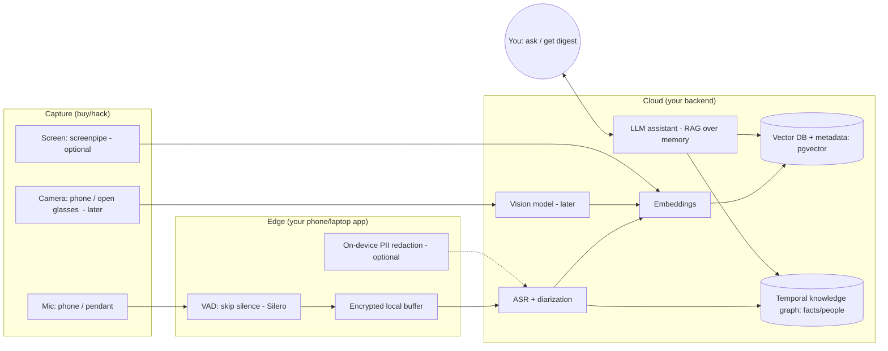

# Omnisense — Master Plan

> A 24/7 "second brain": a wearable + software system that listens, watches, and
> remembers your life so you can ask it anything later — what was decided in a
> meeting, where you left your keys, or how you fixed something last time.

**Document status:** v1 (founding plan). Based on May 2026 market research — see
[`market-research.md`](./market-research.md) for the sourced competitive landscape.

> **Note:** the business context has since evolved — there is now an existing IT/
> software company behind this, an investor (~$1M after a successful demo), and a
> defined business model (hardware at cost + subscription, first 3 months free). The
> **product and technical strategy below still holds** (software-first, audio-first,
> on-device, trust-led); for the company/financial/go-to-market view see
> [`business-plan.md`](./business-plan.md), which is now the primary strategic doc.

**Decisions this plan is built on** (chosen with you up front):
- **Goal:** prototype-to-learn first (not a funded company yet).
- **Approach:** **software-first** — prove the idea on hardware you can buy today.
- **Team/resources:** solo / very small.
- **Form factor:** recommended from research (see §3).

---

## 0. TL;DR — read this first

1. **Do NOT build hardware yet.** Every standalone AI gadget that tried to be its
   own device has failed (Humane AI Pin → bricked & sold for parts; Rabbit R1 →
   "barely reviewable"; Friend → public backlash). The survivors all **tether to a
   phone** and do **one narrow job reliably**. As a solo builder, custom hardware
   is the fastest way to run out of money and time.
2. **Start with AUDIO, not video.** "Remember my conversations & meetings" is the
   stickiest, cheapest, most legally manageable use case — it's what made PLAUD the
   category's commercial winner (~1M units). Vision ("find my keys", "show me how")
   is real but comes later because it's far harder on battery, cost, storage, and
   privacy.
3. **The real product is software: a memory + recall engine.** Capture → transcribe
   → remember → answer. You can build a useful version of this **this month**, for
   yourself, using your phone/laptop and off-the-shelf parts.
4. **Glasses are the north-star form factor** (camera at eye level, socially
   accepted, ~7M Meta units in 2025) — but that's a *later* hardware bet, not where
   a solo prototype starts.
5. **Trust is your only durable edge.** In late 2025 **Meta bought Limitless** and
   **Amazon bought Bee** — the two best memory wearables. You cannot out-scale them.
   You *can* out-trust them with a **local-first, privacy-respecting** design. Make
   that the brand.
6. **Privacy/consent is not a feature — it's the foundation.** An always-recording
   device is legally and socially radioactive if done wrong (see Microsoft Recall's
   meltdown). Default-OFF, on-device by default, encrypted, with real consent UX.

**The single most important sentence:** *Build the "second brain" as software you
personally use every day; let demand — not enthusiasm — decide if hardware ever
gets built.*

---

## 1. Vision & scope

### The vision
A device you wear (eventually: glasses, pendant, ring, or watch — the user picks
the body, the brain is shared) plus software that captures what you hear/see/do,
remembers it, and lets you retrieve or be reminded of anything — a second brain
that is awake 24/7.

### The four "pillars" (use cases), in priority order
| # | Pillar | Example question | Sensor | Difficulty | Phase |
|---|--------|------------------|--------|-----------|-------|
| 1 | **Conversation & meeting memory** | "What did we agree to ship by Friday?" | mic | Medium | MVP |
| 2 | **Screen / digital memory** | "What was that link/doc I saw yesterday?" | screen capture | Low–Med | Early add-on |
| 3 | **Find-my-things** | "Where did I last see my keys?" | camera | High | Phase 2 |
| 4 | **Show-me-how (procedural)** | "How did I reset the router last time?" | camera | Very high | Phase 3 |

Pillars 1 and 2 are **software-only** (no custom hardware). Pillars 3 and 4 need a
**camera** — which is why the eventual hardware is glasses, and why these come later.

### What Omnisense is NOT (deliberately)
- **Not a phone replacement** (that killed Humane & Rabbit). It augments the phone.
- **Not an emotional "AI friend"** (that's Friend.com — different product, heavy
  backlash). Omnisense is a *memory/utility* tool.
- **Not "always uploading everything to our cloud."** That's the trust-killer. Local-first.
- **Not an emotion/biometric profiler.** That's outright illegal in the EU (AI Act).

---

## 2. What the market already taught us → design rules

Full detail and sources are in [`market-research.md`](./market-research.md). The
compressed lessons:

**The graveyard (learn from the dead):**
- **Humane AI Pin** ($699 + $24/mo): standalone, overheated, 2–4 hr battery, slow,
  overpromised "ambient computing", returns outpaced sales, **bricked every unit**
  when servers shut off (Feb 2025), assets sold to HP for ~$116M.
- **Rabbit R1** ($199): the "Large Action Model" was largely an Android app +
  scripts; hardcoded API keys leaked; "$199 AI toy that fails at almost everything."
- **Friend** ($99–129 companion necklace): "wearing your senile grandmother around
  your neck"; ~7–10s latency; became the face of the anti-AI/surveillance backlash.

**The survivors (copy what works):**
- **Meta Ray-Ban** (~$379): ~7M pairs sold in 2025. Phone-tethered, fashionable,
  does a few things reliably (camera, audio, "what am I looking at").
- **PLAUD** (~$159): **commercial leader, 1M+ units.** *Tap-to-record* meetings
  (not always-on) → cloud transcript + summary. Narrow, consent-friendly, sticky.
- **Bee** ($50, always-on) → **acquired by Amazon (Jul 2025)**.
- **Limitless** ($99 pendant, polished consent UX) → **acquired by Meta (Dec 2025)**.

**Ten design rules (non-negotiable):**
1. **Augment the phone; never replace it.** Lean on its compute, screen, connectivity.
2. **One killer use case, done reliably** > a grand "does everything" vision.
3. **Battery & heat are existential** (only relevant when/if you build hardware) —
   design for a full day and cool skin contact, or don't ship.
4. **Latency kills voice UX.** Aim sub-second; do cheap things on-device.
5. **Never overpromise the AI.** Demo only what reliably works.
6. **Summaries & action items are the killer feature**, not raw transcripts.
7. **Default-OFF, opt-in, on-device by default.** (The #1 lesson from MS Recall.)
8. **Consent is part of the product.** Recording indicator + bystander consent flow.
9. **Production-grade security at launch.** No secrets in client code (Rabbit's sin).
10. **Plan for graceful offline/degraded modes** so the thing still has value if a
    server dies (the Humane bricking nightmare destroys trust).

**Strategic reality:** Big Tech now owns the two best memory wearables. A solo
builder wins by being **more trustworthy and more focused**, not bigger. Local-first
privacy + one beloved use case is the wedge.

---

## 3. Strategy for a solo builder: software-first, audio-first

### Why software-first
Hardware for a solo person = months of CAD/electronics/firmware/manufacturing/
certification before you learn whether anyone wants the thing. Software lets you
**validate the core value (memory + recall) in days**, iterate daily, and spend $0
on tooling. Build hardware only after the software is something *you* can't live
without.

### Why audio-first
- It's the **proven** sticky use case (PLAUD, Limitless, Bee).
- It's **cheap** to run and store vs. continuous video.
- It's **far less legally fraught** than video of bystanders (still real — see §6).
- The hardest quality problem — **"who said what" (speaker diarization)** — is where
  every competitor is weak. **Nail diarization and you have a real edge.**

### Recommended form factor (you asked me to choose)
- **North-star (the device you'd eventually build/sell): GLASSES.** The research is
  unambiguous — camera at eye level = true first-person view ("what am I looking
  at"), open-ear audio + mic arrays are built in, frames are socially accepted, and
  the category is scaling (Meta ~7M/yr). This is the only form factor that serves all
  four pillars well.
- **For the prototype (now): your PHONE + a clip-on / pendant mic for audio.** Add a
  *hackable, open* camera device only when you reach Pillar 3.
- **Rings/watches: companion role only.** They can't carry a useful camera or AI
  compute — fine as a remote/notification surface, not the lead device.

### Buy / hack — don't build (capability → what to use now)
| Capability | Use today (prototype) | Notes |
|---|---|---|
| **Audio capture** | Phone app (always-record w/ consent) or AirPods; optional **Omi** open-source pendant (~$70–89) | Omi is MIT-licensed (PCB+firmware) — you own the data, unlike closed devices |
| **Vision capture (later)** | Phone camera; **Omi Glass** (ESP32-S3, open) or **Brilliant Labs Frame** (open SDK, has camera) | **Avoid Meta Ray-Ban for the brain** — great hardware but **closed**, no raw camera access for third-party apps |
| **Screen/PC memory** | **screenpipe** (open-source, local) or OS screenshot APIs | Local-first; mirrors what MS Recall does but on your terms |
| **The "brain" (AI)** | Cloud LLM API (Claude / GPT / Gemini) + your code | This is where you spend your effort |

> Key constraint to remember: **Meta's glasses are a closed platform.** You can buy
> them and admire them, but you cannot pipe their camera into your own "second
> brain" app. For DIY vision, use open hardware or the phone.

---

## 4. Product: the core loop and how each pillar works

### The universal loop (everything is a variation of this)
```
CAPTURE → PROCESS → REMEMBER → RECALL → SURFACE
 (sense)  (transcribe/  (index   (you ask /  (proactive
          diarize/      into      it answers   reminders &
          caption)      memory)   via RAG)     daily digest)
```

### Pillar 1 — Conversation & meeting memory (the MVP)
1. **Capture** audio (phone/pendant) only when enabled; buffer locally.
2. **Process:** voice-activity detection (skip silence) → speech-to-text →
   **speaker diarization** ("who said what") → optional PII redaction.
3. **Remember:** chunk the transcript, create embeddings, store in a vector DB with
   metadata (time, speaker, location, source). Distill durable facts (people,
   commitments, decisions) into a lightweight knowledge graph.
4. **Recall:** you ask in natural language → retrieve the relevant chunks/facts →
   an LLM answers with citations ("at 2:14pm, Sara said …").
5. **Surface:** a **morning digest** of yesterday's commitments, decisions, and
   to-dos. This proactive summary is the feature people actually love.

### Pillar 2 — Screen / digital memory (easy, software-only add-on)
- Periodically capture screen text (OCR) locally with `screenpipe` or OS APIs.
- Index it the same way as transcripts → "what was that article about X I read?"
- **Default-off, local-only, with app/site exclusions** (the Recall lessons).

### Pillar 3 — Find-my-things (Phase 2, needs camera)
- Sample frames from a worn/handheld camera; a small vision model captions/detects
  objects; embed the crop + caption + **timestamp + coarse location** and index it.
- "Where are my keys?" = a temporal-spatial lookup: *"last frame where keys were
  visible, 6:32pm, on the kitchen counter,"* returned as an image.
- Hard parts: when to capture (battery), storage, accuracy, and privacy.

### Pillar 4 — Show-me-how / procedural memory (Phase 3, hardest)
- Detect a recurring activity (e.g., fixing the router), store the video segment +
  a step-by-step summary the LLM extracts from the frames + narration.
- "How did I do this last time?" = retrieve that segment and replay/summarize the steps.
- This is research-grade; treat as a north-star demo, not a near-term deliverable.

---

## 5. Technical architecture

Three tiers: **wearable/sensor → phone (edge) → cloud.** Push cheap/private work to
the edge; use the cloud for heavy accuracy.



### Layer-by-layer, with concrete options (May 2026)
- **Edge / phone:** **Silero VAD** to gate capture; optional on-device transcription
  via **faster-whisper** / **distil-whisper** for offline/private mode; optional
  on-device PII redaction via a small LLM (**Gemma 3 4B** / **Phi-4-mini**).
- **Speech-to-text (cloud, best quality):** **Soniox** or **Deepgram Nova-3** —
  both bundle **diarization** and stream cheaply (~$0.12–0.30/hr range). Alternative:
  **AssemblyAI**. These beat self-hosting at the prototype stage.
- **Diarization:** comes with the ASR API above; if self-hosting, **pyannote 3.1**
  (open) or **NVIDIA NeMo Sortformer** (more accurate). *This is the quality battle.*
- **Vision (later):** on-device **Moondream** / **SmolVLM** for "what's this";
  cloud **Gemini Flash / GPT-mini / Claude Haiku** for harder reasoning + OCR.
- **Memory store:** start with **pgvector** (Postgres + vectors + time/metadata
  filters in one DB — perfect for a life-log; good to ~10–100M vectors). Move to
  **Qdrant** if you outgrow it. Use **hybrid retrieval** (dense embeddings + keyword/
  BM25) so names and exact phrases are findable.
- **Agent memory pattern:** treat raw transcripts/frames as **episodic** memory
  (append-only, timestamped, recency-weighted); distill **semantic** facts (people,
  preferences, commitments) into a graph. Frameworks worth using: **Mem0**
  (pragmatic default), **Graphiti/Zep** (temporal graph — great for "when did X
  happen / what changed"). Roll up / decay old episodes to control volume & cost.
- **Assistant/brain:** a **frontier LLM** (Claude Haiku/Sonnet, GPT-mini, or Gemini
  Flash) doing **RAG** over the memory, with tool-calls to filter by time, person,
  location, or source. Default to the latest, most capable Claude model for the
  reasoning layer; use a cheap tier for high-volume summarization.

### Recommended starter stack (opinionated, solo-friendly)
- **App:** start as a simple **web app + a thin phone recorder** (or a Mac/PC
  background recorder) — fastest to iterate. Native mobile later.
- **Backend:** Python (FastAPI) or Node; **Postgres + pgvector**; object storage for
  audio; a job queue for processing.
- **ASR+diarization:** Deepgram or Soniox API.
- **Embeddings + LLM:** your provider of choice; Claude for the reasoning/answers.
- **Memory:** pgvector + Mem0; add Graphiti when you need "what changed when."
- **Screen (optional):** screenpipe.
> Caveat: exact model names/prices above move fast — treat as "as of May 2026,"
> verify current tiers before committing.

---

## 6. Privacy, security, legal & ethics — the foundation (read carefully)

This is the part that sinks always-on devices. Treat it as a first-class feature.
**This section is research synthesis, not legal advice — get a lawyer before any
public launch.**

### Why it's existential
- **Microsoft Recall** (the screen-memory feature) stored everything in a **plaintext
  database**; researchers trivially extracted "the last three months of everything
  you typed and viewed." Massive backlash, regulator inquiry, year-long redesign. The
  lesson: **local storage is not security**, and **default-on is a disaster.**
- Recording bystanders has **real legal exposure**:
  - **US:** ~11–12 states require **all-party consent** (e.g., California, Illinois,
    Florida, Pennsylvania, Washington, Massachusetts…). Recording a non-consenting
    person there can be a **crime** + civil liability. (Exact list varies — verify.)
  - **Illinois BIPA:** voiceprints & faceprints are **biometric identifiers** — a
    class-action magnet; requires informed written consent + retention/destruction policy.
  - **EU GDPR:** recording strangers makes you a **data controller** (the "household
    exemption" does *not* cover capturing third parties in public — *Ryneš* case).
  - **EU AI Act:** **emotion recognition** (workplace/education) and **biometric
    categorization** are **prohibited** (fines up to €35M / 7% of turnover). Do **not**
    build mood/emotion features.

### Privacy & security design requirements (checklist — build these in from day 1)
- [ ] **Default OFF.** Recording is opt-in, never on out of the box.
- [ ] **On-device processing by default;** cloud only with explicit, revocable opt-in.
- [ ] **Encryption everywhere:** AES-256 at rest, TLS in transit; hardware-backed
      keys where possible; gate access behind device biometric/PIN.
- [ ] **Clear, hard-to-defeat recording indicator** (LED + optional audible). No
      silent-record mode.
- [ ] **Bystander consent:** default to capturing **only the enrolled owner's voice**
      (voice-ID gating, à la Limitless "Consent Mode"); others opt in verbally.
- [ ] **Data minimization & sensitive-content filtering:** exclude passwords/financial/
      health; per-app/site exclusions; "private zones" (e.g., bathrooms) auto-pause.
- [ ] **Retention controls:** short configurable defaults, auto-purge, one-tap full
      deletion (GDPR/CCPA erasure; BIPA destruction policy).
- [ ] **Regional feature-gating:** disable/limit recording features in all-party-
      consent states and the EU; geofence emotion/biometric features OFF (they're banned).
- [ ] **No secrets in client code;** have a vulnerability-disclosure process (Rabbit's lesson).
- [ ] **Graceful degradation** if the cloud is unavailable.

### Turn privacy into the brand
Since Meta and Amazon now own the big memory wearables, **"your memories stay yours —
local-first, encrypted, you hold the keys"** is the most credible differentiator a
small independent builder has. Lead with it.

---

## 7. Roadmap (solo, realistic)

Each phase has a **gate**: don't advance until it's met. The goal of every early
phase is *learning*, not shipping.

### Phase 0 — Spike (Week 1–2): "Does this help me?"
- Record one real meeting (with consent) on your laptop/phone.
- Pipe it through an ASR+diarization API → store transcript → ask an LLM questions
  about it ("what did I commit to?"). A few hundred lines of code, no UI polish.
- **Gate:** *You personally find the answers genuinely useful.* If not, rethink.

### Phase 1 — Personal daily-driver MVP (Week 3–8): "I use it every day"
- Real capture loop (phone + optional Omi pendant), background processing, pgvector
  memory, a simple query box, and a **morning digest**.
- Privacy basics: local-first, encrypted, default-off, easy delete.
- **Dogfood it daily for a few weeks.**
- **Gate:** *You'd be annoyed to lose it.* Track: do you open it daily? does recall work?

### Phase 2 — Small private alpha + first vision (Month 3–5)
- Add **screen memory** (easy win) and the first **vision pillar (find-my-things)**
  using your phone or an open camera device.
- Invite **5–20 trusted people** (explicit consent; respect their bystanders).
- **Gate:** *Several non-you humans use it weekly and would miss it.*

### Phase 3 — Decide the real product (Month 6–12)
- Sharpen **diarization** (your edge); attempt **"show-me-how"** as a wow demo.
- Decide: is there a product/business here? Only **now** consider hardware — and if
  so, **fork the open-source Omi design** rather than starting from scratch.
- **Gate:** evidence of real demand + a defensible angle (trust, a vertical, or diarization quality).

---

## 8. Cost, effort & the hard bottlenecks

### Running-cost intuition (per user, prototype scale)
- Cloud ASR + diarization: roughly **$0.10–0.45 per hour of audio**.
- Embeddings + storage + LLM queries: small per-hour, but **24/7 audio adds up** —
  a heavy day could be a few dollars. **Continuous video would be far more** (storage
  + vision model calls) — another reason video waits.
- **Implication:** aggressive **silence-skipping (VAD)**, summarization, and
  **rollup/decay of old data** aren't optional — they're what make the economics work.

### The hardest problems, ranked
1. **Battery / always-on power** — *only if you build hardware*; physically caps
   continuous capture to ~a day even with silence-gating.
2. **Diarization accuracy** in noisy, overlapping, far-field audio — the main quality
   ceiling. (Also your biggest opportunity.)
3. **Latency** of the capture→transcribe→retrieve→answer round-trip.
4. **Storage/compute cost** of 24/7 capture at scale.
5. **Privacy/consent** — a product and legal constraint, not just a technical one.

---

## 9. Risks & open decisions (input needed from you over time)

**Top risks:** (a) Big Tech commoditizes basic audio memory → you *must* differentiate
on trust/focus; (b) privacy backlash or legal exposure → default-off + local-first +
counsel; (c) the "novelty then drawer" churn that kills ambient devices → win on a
*daily* habit (the morning digest + reliable recall), not a gimmick; (d) solo
bandwidth → stay ruthlessly scoped to Pillar 1 until it's loved.

**Open decisions (we can tackle as they come up):**
- Cloud-accuracy vs. local-first-privacy balance for v1 (recommendation: local-first
  storage, cloud only for processing, clearly disclosed).
- Which capture device to buy first (recommendation: just your phone; add Omi pendant
  if you want hands-free).
- Who the first target user is (recommendation: *you*, then knowledge workers with
  lots of meetings — the PLAUD audience).

---

## 10. Immediate next steps (this week)

1. **Confirm scope:** agree we start with **Pillar 1 (conversation memory), software
   only**, on your phone/laptop.
2. **Pick the processing API** (Deepgram or Soniox free tier) and an LLM provider.
3. **Build the Phase-0 spike:** record → transcribe+diarize → ask questions. (I can
   scaffold this repo — backend + a tiny UI — on request.)
4. **Set up the privacy defaults now** (local encrypted storage, default-off,
   one-tap delete) so they're not bolted on later.
5. **Start a decisions log** in `docs/` so choices and their reasons are tracked.

> When you're ready, say the word and I'll scaffold the Phase-0 spike in this repo.

---

*See [`market-research.md`](./market-research.md) for the full competitive landscape,
device-by-device findings, and sources behind every claim above.*
